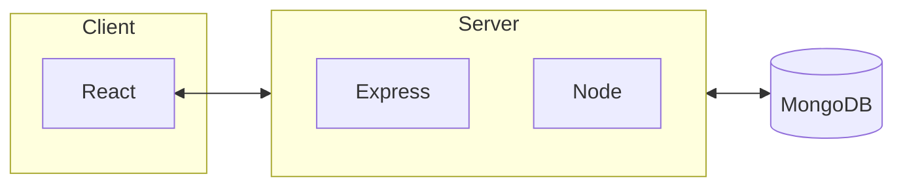

## About this project

In this project I build small application to save client data, using MERN-stack.

| Character | Meaning |
| :--: | :-----: |
| M  | MongoDb   |
| E  | Express.js |
| R  | React.js |
| N  | Node.js |

Eventhough my projects idea is to use MERN, I decided to start the project by spending most of the time with Express. In Express I build the endpoints, handel the request and make validations. One idea I had that I wanted to implement was external API call, when saving data. So in my project, when client inputs business id, Express makes external API call to fetch clients address and saves that with other data.

## Technical information

## MongoDB

Data is saved in MongoDb. I created new cluster and configured it with my credentials so I could access it with my app. In Mongo I have database called **client** and there I have collection called **records**.

## Express, Node

App uses **Axios** library when making request to various endpoints. 
When building middleware for authentication I implemented commonly used *bcrypt* and *jwt* functions, since I wanted to build app that uses token based authentication. 

In my app when logged in you get token, that validates the user. But you also get information about username and role. Role determind if you are allowed to make certain **CRUD** operations.

## React

Applications Frontend is build using **React**. In my client side of project I have implemented **Bootstrap** but also Reacts **MUI** tools. Using both because I started using Bootstrap but during the development started implementing MUI elements and I haven't refactored all the code from old Bootstrap. 

## Architecture diagram

